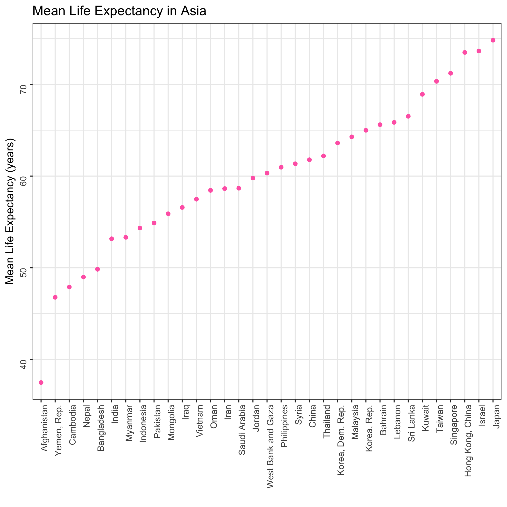
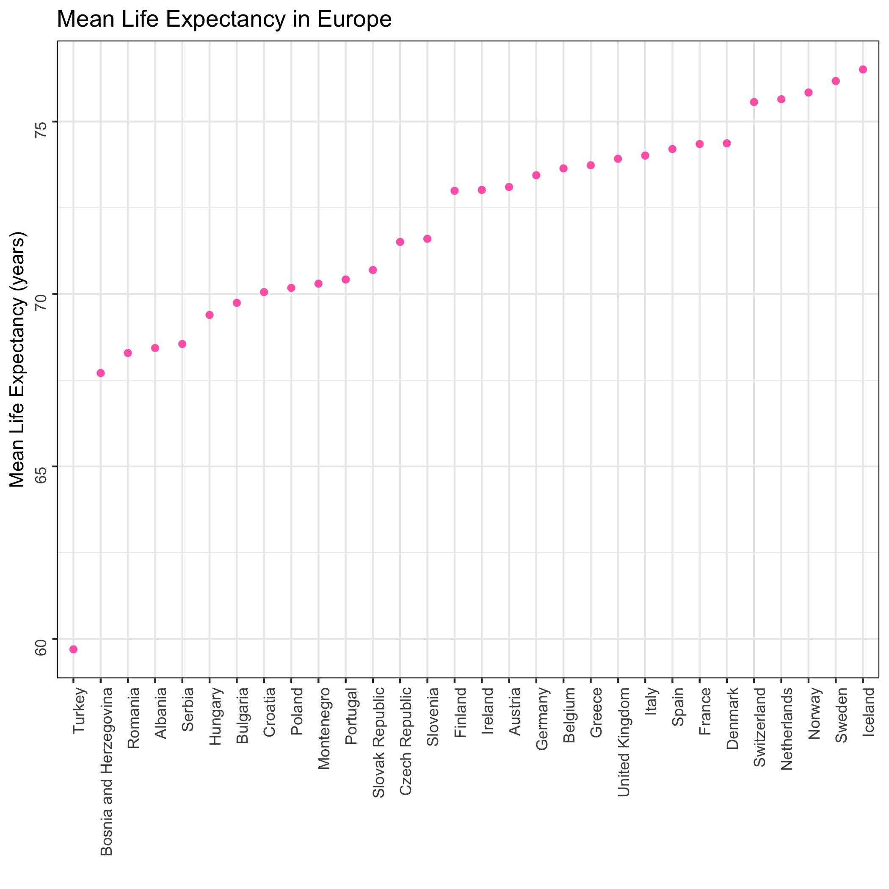

The goal of this analysis is to determine the mean life expectancy in countries of Asia and Europe. These continents were randomly chosen as examples. The `gapminder` data set contains life expectancy data from 12 different years. For each country, I calculated the mean life expectancy of those years. Let's have a look at Asia first:

```{r, message = FALSE, warning = FALSE}
library(tidyverse)
library(knitr)

Asia_data <- read_csv("Asia/Asia_selection.csv")

kable(head(Asia_data), col.names = c("Country", "Mean Life Expectancy"))
```

Here is a plot of the mean life expectancy in each country, sorted by mean life expectancy:



Looks like Afghanistan has the lowest mean life expectancy and Japan has the highest.

Let's have a look at the same data from Europe:

```{r, message = FALSE}
Europe_data <- read_csv("Europe/Europe_selection.csv")

kable(head(Europe_data), col.names = c("Country", "Mean Life Expectancy"))
```


Here is the plot of mean life expectancies for each country in Europe:



Turkey has the lowest mean life expectancy in Europe, Iceland has the highest.
