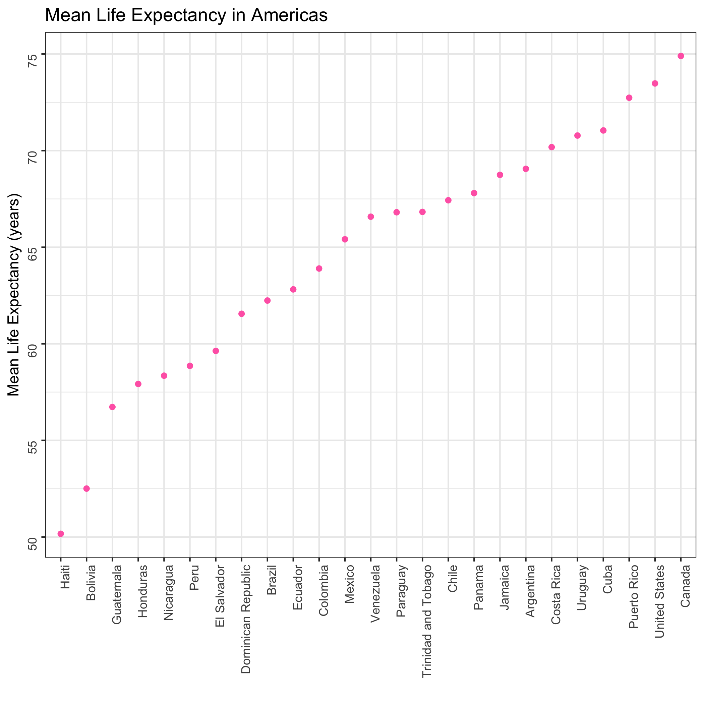
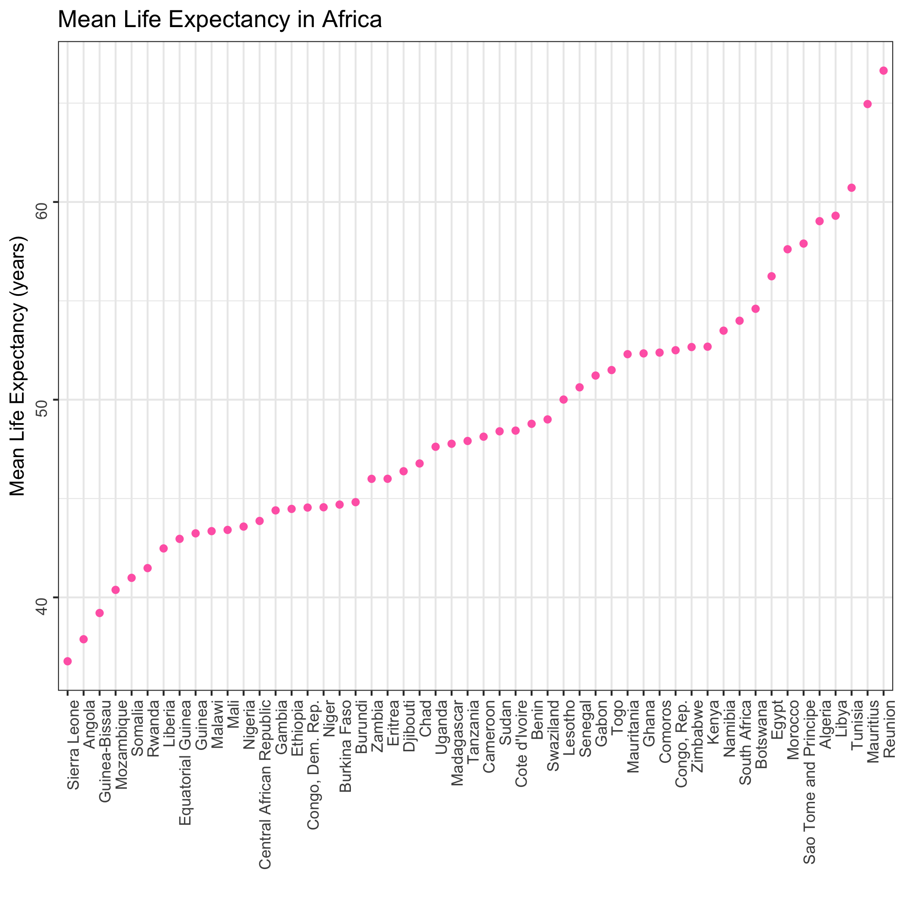

Life expectancy in the different continents of the world
================
Frederike Basedow
27 November 2018

The goal of this analysis is to determine the mean life expectancy in countries of each continent. The `gapminder` data set contains life expectancy data from 12 different years. For each country, I calculated the mean life expectancy of those years. I excluded Oceania from this analysis as it only contains 2 countries and is not very interesting to look at. Let's have a look at Asia first:

``` r
library(tidyverse)
library(knitr)

Asia_data <- read_csv("Asia/Asia_selection.csv")

kable(head(Asia_data), col.names = c("Country", "Mean Life Expectancy"))
```

| Country          |  Mean Life Expectancy|
|:-----------------|---------------------:|
| Afghanistan      |              37.47883|
| Bahrain          |              65.60567|
| Bangladesh       |              49.83408|
| Cambodia         |              47.90275|
| China            |              61.78514|
| Hong Kong, China |              73.49283|

Here is a plot of the mean life expectancy in each country, sorted by mean life expectancy:


Looks like Afghanistan has the lowest mean life expectancy and Japan has the highest.

Let's have a look at the same data from Europe:

``` r
Europe_data <- read_csv("Europe/Europe_selection.csv")

kable(head(Europe_data), col.names = c("Country", "Mean Life Expectancy"))
```

| Country                |  Mean Life Expectancy|
|:-----------------------|---------------------:|
| Albania                |              68.43292|
| Austria                |              73.10325|
| Belgium                |              73.64175|
| Bosnia and Herzegovina |              67.70783|
| Bulgaria               |              69.74375|
| Croatia                |              70.05592|

Here is the plot of mean life expectancies for each country in Europe:


Turkey has the lowest mean life expectancy in Europe, Iceland has the highest.

Next, we'll look at the data from the Americas:

``` r
Americas_data <- read_csv("Americas/Americas_selection.csv")
```

    ## Parsed with column specification:
    ## cols(
    ##   country = col_character(),
    ##   mean_lifeExp = col_double()
    ## )

``` r
kable(head(Americas_data), col.names = c("Country", "Mean Life Expectancy"))
```

| Country   |  Mean Life Expectancy|
|:----------|---------------------:|
| Argentina |              69.06042|
| Bolivia   |              52.50458|
| Brazil    |              62.23950|
| Canada    |              74.90275|
| Chile     |              67.43092|
| Colombia  |              63.89775|

Here is the plot of mean life expectancies for each country in the Americas:



Haiti has the lowest mean life expectancy of all countries in the Americas, Canada has the highest.

And here is a glimpse of the data from Africa:

``` r
Africa_data <- read_csv("Africa/Africa_selection.csv")
```

    ## Parsed with column specification:
    ## cols(
    ##   country = col_character(),
    ##   mean_lifeExp = col_double()
    ## )

``` r
kable(head(Africa_data), col.names = c("Country", "Mean Life Expectancy"))
```

| Country      |  Mean Life Expectancy|
|:-------------|---------------------:|
| Algeria      |              59.03017|
| Angola       |              37.88350|
| Benin        |              48.77992|
| Botswana     |              54.59750|
| Burkina Faso |              44.69400|
| Burundi      |              44.81733|

Here is the plot of mean life expectancies for each country in Africa:



In Africa, Sierra Leone is the country with the lowest mean life expectancy, Reunion has the highest.
