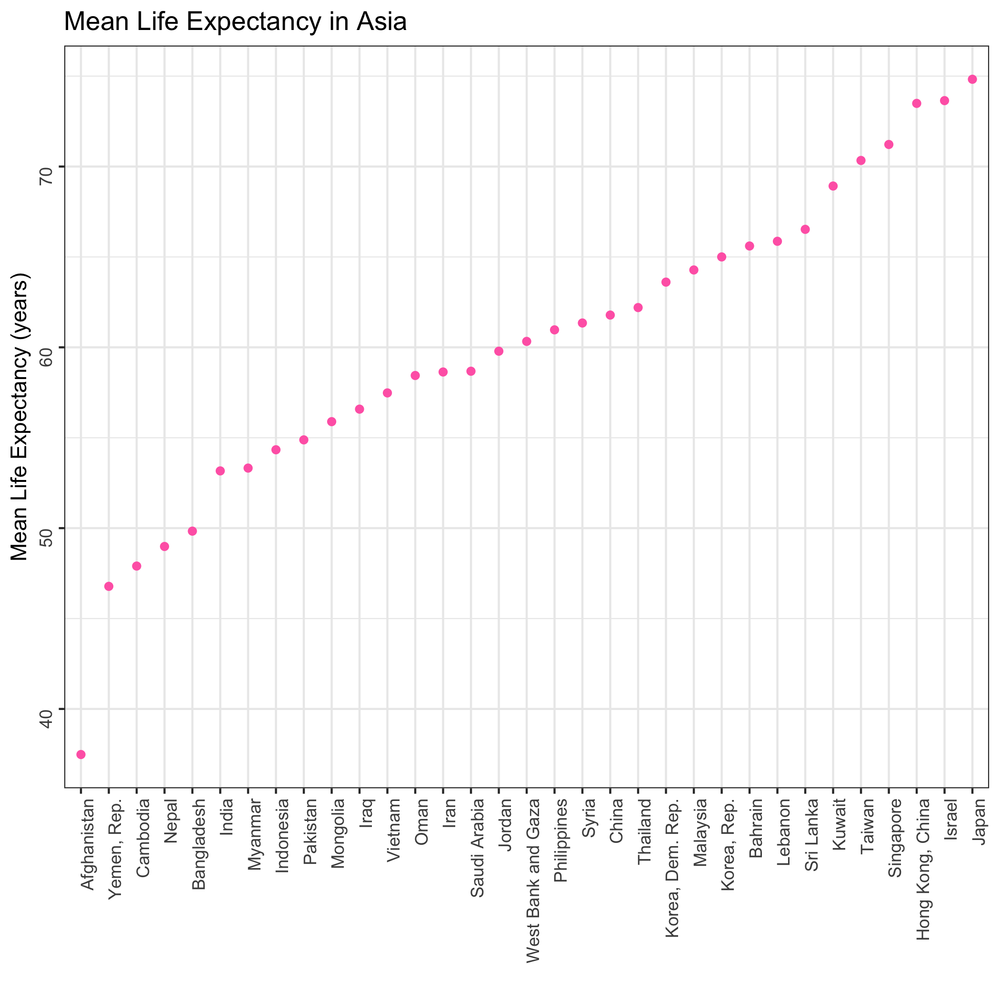
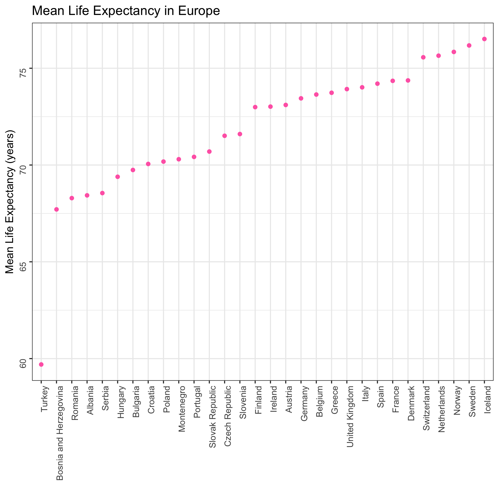

Life Expectancy in Europe and Asia
================
Frederike Basedow
27 November 2018

The goal of this analysis is to determine the mean life expectancy in countries in Asia and Europe. The `gapminder` data set contain life expectancy data from 12 different years. For each country, I calculated the mean life expectancy of those years. Let's have a look at Asia first:

``` r
library(tidyverse)
library(knitr)
Asia_data <- read_csv("Asia_selection.csv")

kable(head(Asia_data), col.names = c("Country", "Mean Life Expectancy"))
```

| Country          |  Mean Life Expectancy|
|:-----------------|---------------------:|
| Afghanistan      |              37.47883|
| Bahrain          |              65.60567|
| Bangladesh       |              49.83408|
| Cambodia         |              47.90275|
| China            |              61.78514|
| Hong Kong, China |              73.49283|

How many countries in Asia do we have data from?

``` r
nrow(Asia_data)
```

    ## [1] 33

There are 33 countries included in the data from Asia.

What is the lowest and highest mean life expectancy?

``` r
round(min(Asia_data$mean_lifeExp), 2)
```

    ## [1] 37.48

``` r
round(max(Asia_data$mean_lifeExp), 2)
```

    ## [1] 74.83

The lowest life expectancy in a country in Asia is 37 years, the highest is 75 years.

Here is a plot of the mean life expectancy in each country, sorted by mean life expectancy:



Looks like Afghanistan has the lowest mean life expectancy and Japan has the highest.

Let's have a look at the same data from Europe:

``` r
Europe_data <- read_csv("Europe_selection.csv")

kable(head(Europe_data), col.names = c("Country", "Mean Life Expectancy"))
```

| Country                |  Mean Life Expectancy|
|:-----------------------|---------------------:|
| Albania                |              68.43292|
| Austria                |              73.10325|
| Belgium                |              73.64175|
| Bosnia and Herzegovina |              67.70783|
| Bulgaria               |              69.74375|
| Croatia                |              70.05592|

How many countries are included in the Europe data?

``` r
nrow(Europe_data)
```

    ## [1] 30

There are 30 countries from Europe.

What are the lowest and highest mean life expectancies in Europe?

``` r
round(min(Europe_data$mean_lifeExp), 2)
```

    ## [1] 59.7

``` r
round(max(Europe_data$mean_lifeExp), 2)
```

    ## [1] 76.51

The lowest life expectancy in Europe is 60 years, the highest it 77 years. Here is the plot of mean life expectancies for each country in Europe:


